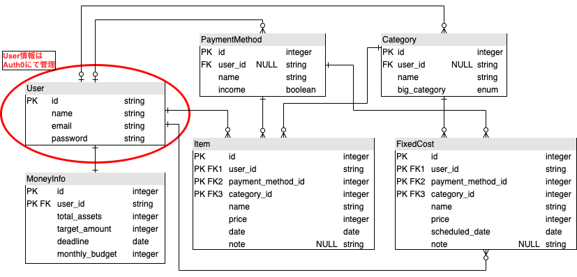

# 家計簿アプリ「SUM APP」について
本アプリケーションは貯金目標の達成を補助してくれる家計簿アプリです。
 
以下のアカウントでログインできますので、ご利用ください。  
メールアドレス：test.user.for.portfolio@gmail.com 
パスワード：Testuser2021  

- [アプリケーションURL](https://www.kakeibo-app.com/)
- [アプリケーション概要](https://www.kakeibo-app.com/tech_info)  

## アプリ概要
### ○アプリコンセプト
本アプリケーションのコンセプトは以下の２点です。

1. 日々の収支情報を登録し家計簿として使用でき、自分の経済活動を視覚化できる。
2. 貯金目標を立て、それを達成できるように手助けをする。

お金を「加算する、合計する」という意味合いを持つ
「SUM UP」と「Application」を掛け合わせ「SUM APP」と名づけました。 
ロゴは貯金を積み重ねることで、右肩上がりになっていく折れ線グラフと「Thumbs up」を連想させるデザインとなっています。 

主に以下の３点の機能で構成されています。

- 日々の収支を登録する機能(単体登録、一括登録)
- 月々の収支情報のデータを確認する機能(円グラフや棒グラフ、折れ線グラフ) 
- 貯金目標達成を手助けする機能(総資産額の管理、月予算の設定、月残り予算)

### ○開発の背景
欲しいものを買うために、将来のために、しっかりと貯金したい！と思ったのが開発のきっかけです。 
しかし、貯金しようと思っても

- 「何に使ったかわからないけどお金が減っていく！」
- 「月々いくら貯金すればいいんだ？」
- 「モチベーションが保てない！」

 といった問題に直面しました。 
そこで解決方法として以下の３点を考えました。

- 家計簿をつける。
- 収支のカテゴリ別の内訳を分析して無駄遣いしている部分を探す。
- 月々に貯金する額と使用していい金額を決める。

 これらを視覚化することで、貯金のモチベーションを保つこともできるのではないかと考え、このアプリケーションを作成することにしました。

## 使用技術
- フロントエンド(React + TypeScript + Redux)
    - redux-thunk：　Reduxで非同期処理を行えるようにするためのミドルウェア。
    - reselect：　stateの中から任意のパラメータを受け取るためのライブラリ。
    - material-ui：　UIデザイン関連のコンポーネントを提供しているライブラリ。UIデザイン周りの実装で非常に役立ちました。
    - react-chartjs-2：　円グラフや棒グラフ、折れ線グラフといったチャートを簡単に作成できるライブラリ。収支情報のまとめをグラフ化するために用いました。
    - react-calendar：　カレンダーを簡単に作成することができるライブラリ。
    - connected-react-router：　Reduxのstoreでrouterの情報を管理できるようにするライブラリ。historyの管理や画面遷移の実装のため使用しました。
    - axios：　ブラウザからHTTPリクエストを送信するためのライブラリ。フロントエンド側とAPI側で通信を行うために使用しました。
    - react-router： URLとコンポーネントを紐付け、SPA(シングルページアプリケーション)としてページの更新を行うライブラリ。
 

- バックエンド(Ruby on Rails)
    - Rspec：　Railsの代表的なテストツールの一つ。単体テスト、統合テストを実行するために使用しました。
    - Factory Bot：　テストのサンプルデータを簡単に作成することができるgem。
 

 

- インフラ(AWS, NGINX, Docker)
    - Route53：　サイトを独自ドメインと紐づけるために使用しました。
    - ACM：　サイトの通信スキームをHTTPS化するために使用しました。
    - ALB：　通信の負荷分散を行うロードバランサー。
    - S3：　フロントエンド側のホスティングのために使用。
    - ECS(Fargate)：　コンテナ向けのサーバーレスコンピューティングサービス。RailsとNGINXをデプロイするために使用しました。
    - ECR：　RailsとNGINXのDockerイメージを保存するためのレジストリとして使用しました。
    - RDS：　クラウド上でリレーショナルデータベースを使用するサービス。PostgreSQLを使用しました。
    - API Gateway： 問い合わせフォームから送られてきたデータを受け取りLambdaへ送るために使用しました。
    - Lambda： 送られてきたデータを元にメールを作成するために使用しました。
    - SES： Lambdaで作成したメールを管理者に送信するために使用しました。
 

 

- 開発環境(Docker, docker-compose)[[開発環境雛形]](https://github.com/nobumitsu-1995/rails-nginx-react-docker)
    - db: postgreSQL
    - api: Ruby on Rails
    - front: React
    - web: NGINX

## 機能一覧

- 収支を登録する機能(単体登録、一括登録)
- 収支情報を参照、編集、削除する機能
- カスタム収支カテゴリ、カスタム支払方法を作成、参照、編集、削除する機能
- 日別収支金額(棒グラフ)、月々の収入,消費カテゴリ内訳(円グラフ)、月予算残高の推移(折れ線グラフ)を確認する機能
- 貯金目標達成を手助けする機能(総資産額の管理、月予算の設定、月残り予算)
- ランディングページのお問い合わせフォームからメールを送る機能

1. 収支の単体登録機能 

2. 収支の一括登録機能 

3. 収支情報の参照、編集、削除 

4. カスタム収支カテゴリの作成、参照、編集、削除 

5. 収支情報の閲覧 

6. 貯金情報の設定、確認 

## 今後の実装したい機能、反省点
### ○今後実装したい機能
本アプリケーションは基本的な機能はすでに使用できますが、まだ不完全で改善点が多々残っております。 今後のアップデートで以下の機能を実装していきたいと考えています。

1. 固定収支情報を登録することで毎月の固定収支を自動で登録できるようにする。
2. 検索機能を追加し、収支情報を検索できるようにする。
3. CI/CDサービスの導入

#### 固定収支情報を登録することで毎月の固定収支を自動で登録できるようにする。
毎月の収入や出費には一部固定のものがあると思います。そういった情報を毎月自分の手で入力するのは非常に手間になるので自動化できればと考えています。API側の機能はすでに実装されているのでフロント側でタスクを設定できるようにする予定です。ECSを利用して「日付とFixed_costsテーブルレコードのscheduled_dateが一致する固定収支情報を収支情報として登録する」というタスクを一日一回定期実行する処理を作成しようと考えています。
 

#### 検索機能を追加し、収支情報を検索できるようにする。
Railsに「Elastic Search」を導入し、収支情報の検索機能を作成する予定です。 また、フロント側でも収支情報のテーブルにソート機能をつけるなどして、より使用しやすくしたいと考えています。
 

#### CI/CDサービスの導入
実務ではほとんどの場合CI/CDサービスを導入し、デプロイやテスト等を自動化している印象がありますが、 このプロジェクトではまだ導入できていません。今後も機能等アップデートしていく予定なので、少なくともデプロイの自動化には 対応したいなと考えています。
 

### ○反省点
- ディレクトリ構成について 
ディレクトリ構成はアトミックデザインを参考に作成しました。しかし開発が進むにつれて「このコンポーネントはどこに配置しよう？」「このコンポーネントはどこに配置したっけ？」と困ることが多々ありました。また、一つのコンポーネントのコード量が肥大化してしまっているものもあり、可読性が低くなってしまいました。ディレクトリ構成やコードの書き方に関して更に研究すべきだと感じました

- Githubの使い方 
ブランチを分けずに全てmasterブランチにpushしてチーム開発を意識した開発ができていませんでした。また、IssuesやPull requestsを有効に使用してチーム開発を意識した開発をすべきだったと感じました。

- UIデザインについて 
UIデザインに関して、全くの無知なのにも関わらず自分の感覚でフロントエンド開発をしてしまったのは失敗でした。デザインが稚拙だなと感じるところや、操作がしづらいなと感じるところが多々あるので、見本となるサイトを決めて、それを模倣する形で作成するべきだったと感じます。今後はUIデザイン関連の学習も必要だなと感じました。