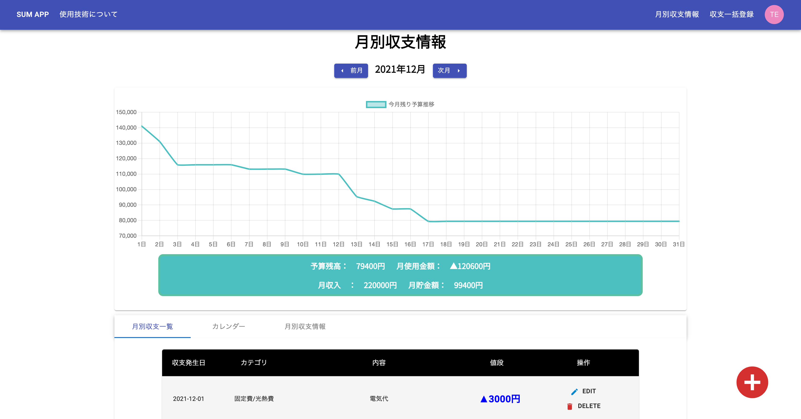
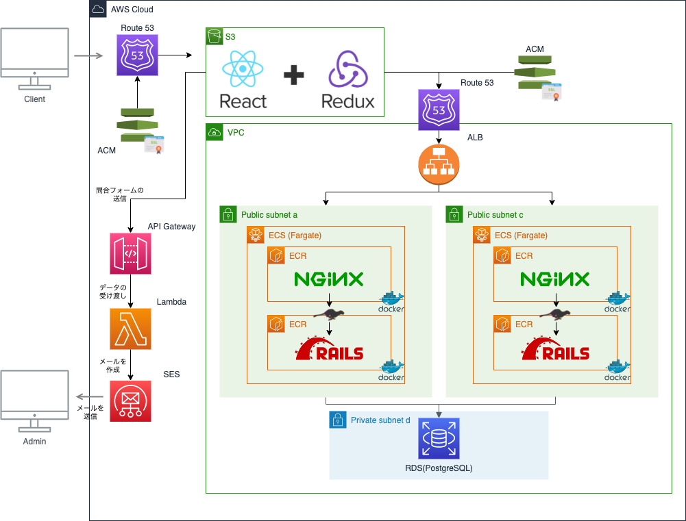

# KakeiboApp_v2_frontについて
このソースコードは家計簿アプリ「SUM APP」のフロントエンド部分になります。
 
また「SUM APP」は貯金目標の達成を補助してくれる家計簿アプリです。アプリケーションのURL、アプリケーション概要につきましては以下をご参照ください。
  
以下の情報でログイン可能です。  
メールアドレス：test.user.for.portfolio@gmail.com 
パスワード：Testuser2021
 
- [アプリケーションURL](https://www.kakeibo-app.com/)
- [アプリケーション概要](https://www.kakeibo-app.com/tech_info)

## インフラ構成について
インフラ構成につきましては、以下の図の通りAWSを中心に構築しています。
 
本ソースコードは以下の図のREACT + REDUX部分になります。

## 実装機能について
実装されている機能に関しては以下のようになっています。
- ユーザーの作成及びログイン機能
- 収支情報を登録、編集、削除する機能
- ユーザーごとにカテゴリ、支払情報等を追加する機能
- 合計保有資産、貯金目標、貯金達成目標日、月予算を登録して月々の残り予算、必要月貯金額等を算出する機能
- 日別収支情報、カテゴリ別収支内訳等の分析をする機能

## 使用している主なライブラリについて
### UI実装周り
- material-ui：　UIデザイン関連のコンポーネントを提供しているライブラリ。UIデザイン周りの実装で非常に役立ちました。
- react-chartjs-2：　円グラフや棒グラフ、折れ線グラフといったチャートを簡単に作成できるライブラリ。収支情報のまとめをグラフ化するために用いました。
- react-calendar：　カレンダーを簡単に作成することができるライブラリ。

### Redux周り
- redux：　stateを一元管理するためのライブラリ。開発の進行に伴って、所謂propsのバケツリレーが起きてしまいデータの管理の複雑性が増してしまったため導入しました。
- redux-thunk：　Reduxで非同期処理を行えるようにするためのミドルウェア。
- reselect：　stateの中から任意のパラメータを受け取るためのライブラリ。

### Router周り
- connected-react-router：　Reduxのstoreでrouterの情報を管理できるようにするライブラリ。historyの管理や画面遷移の実装のため使用しました。
- axios：　ブラウザからHTTPリクエストを送信するためのライブラリ。フロントエンド側とAPI側で通信を行うために使用しました。
- react-router： URLとコンポーネントを紐付け、SPA(シングルページアプリケーション)としてページの更新を行うライブラリ。